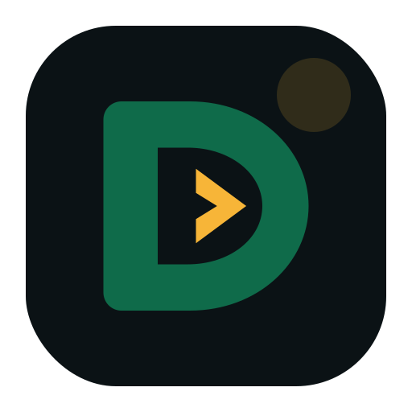

<div align="center">
  

# Doria

**A statically checked, natively compiled language for building software you can read and binaries you can trust.**

</div>

---

## What is Doria?

Doria is a general-purpose systems language built around three commitments: **code that reads plainly, safety that is checked at compile time, and performance that is deterministic.** It compiles to fast, standalone native executables with no garbage collector, no runtime pauses, and no hidden costs — while its syntax stays approachable enough to be someone's first language.

```doria
function greet(string $name, int $year): string
{
    return "Hello, {$name}! Welcome to {$year}.";
}

function main(): void
{
    let $message = greet("newcomer", 2026);
    echo "{$message}\n";
}
```

## Memory safety, in plain words

Doria's memory model is built on ownership: every value has exactly one owner, and when the owner's scope ends, the value is cleaned up — immediately, deterministically, every time. Sharing is governed by two words:

- Everything is **readonly by default**. Passing a value grants the right to look, not to touch.
- **`writable`** grants exclusive access: mutation with a compile-time guarantee that nobody else is watching.
- **`take`** hands ownership over entirely — the signature says so, and the compiler holds everyone to it.

There are no annotations to sprinkle, no sigils to memorize, and no jargon in the diagnostics. When something's wrong, the compiler says so in plain language:

> `$user was given to store() on line 12, so it can no longer be used here — clone it first if you need a copy.`

Use-after-free, data races, double-frees, null surprises: these are compile errors in Doria, not production incidents.

## Design principles

- **Contracts are written down.** Every parameter is explicitly typed — always. Nothing silently defaults to a dynamic type, and nullability is spelled `?T` and enforced.
- **One word, one meaning.** `use` imports. `uses` composes traits. `with` captures in closures. No keyword in Doria ever has two jobs.
- **A standard library with one voice.** Built-in functions follow one uniform naming law — full words, predictable pairs, no cryptic contractions (`str_case_compare`, never `strcasecmp`), the same argument order everywhere.
- **Honest defaults.** Booleans print as `true` and `false`. Integer overflow is an error, not a wraparound. Format strings are checked at compile time. Errors are declared with `throws` and handled with `try`/`catch` — the compiler makes sure of it.
- **Small language, sharp edges filed off.** Where a familiar construct is a known footgun, Doria deliberately does the safer thing instead.

## What people build with it

- **Native services and CLI tools** — single-binary deployment, instant startup, predictable memory.
- **Portable terminal applications** — first-class, cross-platform TUI support (Windows, macOS, Linux) with no hand-written escape sequences: terminal games and tools that just run everywhere.
- **Game engines and performance-critical systems** — deterministic destruction, fixed-width numerics, zero-cost abstractions, and a safe interop story with native libraries.
- **Native power for PHP applications** — Doria libraries compile to packages that PHP code calls like ordinary classes, with generated, type-checked bindings.

## Lineage

Doria was created by a PHP developer who wanted compile-time safety and native performance without giving up readable syntax, and it doesn't hide that. If you know PHP, you'll feel at home in minutes; the `$variables`, the class shapes, the pragmatism all carry over. But familiarity is a doorway, not the destination: Doria is its own language, with its own type system, its own memory model, and its own opinions about what a language owes the people who read code as often as they write it.

## Status

🚧 **Doria is in early, active development and is not yet ready for use.** The compiler is being built stage by stage against a comprehensive language specification, with a native-first architecture and differential testing at every step. Expect rapid change, breaking changes, and honest roadmaps rather than promises.

Stages 11–17 are implemented on the current compiler branch. Immutable UTF-8 strings are real runtime values with Copy semantics, and Stage 17 adds `readline(): ?string`, UTF-8 text-file helpers, exact stderr output, and compiler-checked `sprintf`/`printf`. The interpreter, Cranelift fast profile, and LLVM release profile consume the same validated MIR and the durable parity suite compares exact stdin-driven output, panic text, status, and file side effects. Stage 18 full expression interpolation and `Displayable` is next; general nullable types remain Stage 22, and `Bytes` remains Stage 23.

Watch this organization to follow along as the language, the `doriac` compiler, the `baton` build tool, and the standard library take shape.

---

<div align="center">

*Readable code. Checked contracts. Native binaries.*

</div>
